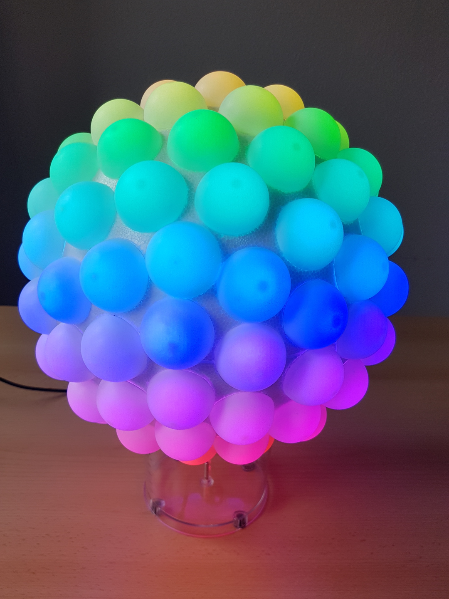

# Sphere² Lamp

A lamp of 122 domes on a sphere, illuminated by individually controlled RGB LEDs.
Using animated color effects, the lamp creates a unique atmosphere.
It can be controlled over USB or bluetooth.

### Replication instructions

Instructions on how to build the lamp can be found in the [construction](construction/README.md) folder.

### Schematics

*coming soon*

### Code

The LED strip is driven by an Arduino Nano. The complete code is located in [code/sphere2-lamp](code/sphere2-lamp)). It uses the [FastLED](https://github.com/FastLED/FastLED) library and features a serial interface to control the Sphere² Lamp.

A simple python program to control the Sphere² Lamp over USB can be found in [code/sphere2-lamp-python-controller](code/sphere2-lamp-python-controller).  

For control via bluetooth low energy (BLE), an Arduino Nano 33 BLE is used. Since the FastLED library is not compatible with the Nano BLE as of now, it connects to the Nano via the serial interface. The code for the BLE controller is located in [code/sphere2-lamp-ble-controller](code/sphere2-lamp-ble-controller).

An android app for control of the lamp is under development.

### Images

