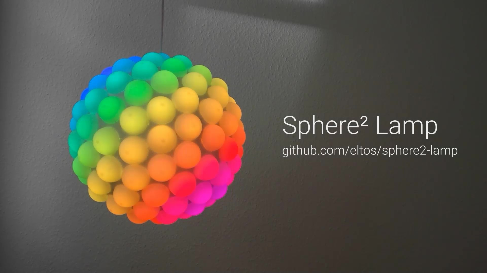

# Sphere² Lamp

A spherical design lamp with 122 domes, illuminated by individually controlled RGB LEDs.
Using animated color effects, the lamp creates a unique atmosphere.
It can be controlled over USB or Bluetooth.

### Demo video

  
https://player.vimeo.com/video/572701831

### Instructions

Instructions on how to build the lamp can be found in the [instructions](instructions) folder.

| [🪙 DONATE](https://github.com/sponsors/eltos) | [❤️ SAY THANKS](https://saythanks.io/to/eltos)
|-|-|

### Code

The LED strip is driven by an Arduino Nano which generates the colorful animations.
The complete code is located in [code/sphere2-lamp](code/sphere2-lamp).
It uses the [FastLED](https://github.com/FastLED/FastLED) library and features a modular serial interface to adjust the animation parameters or manually control the LEDs of the Sphere² Lamp.

By connecting to the serial interface of the Arduino Nano, one can use:
- A python program to control the Sphere² Lamp over USB from a computer.
  The python class as well as a vpython based interactive 3D control UI can be found in [code/sphere2-lamp-python-controller](code/sphere2-lamp-python-controller).  
- An Arduino Nano 33 BLE[[1]](#footnote-1) to control the Sphere² Lamp over **Bluetooth low energy (BLE)** from a smartphone.
  The code for the BLE controller is located in [code/sphere2-lamp-ble-controller](code/sphere2-lamp-ble-controller).  
  A compatible android app for control via BLE can be found in [code/sphere2-lamp-ble-remote-android-app](code/sphere2-lamp-ble-remote-android-app) and is also available from [Google Play](https://play.google.com/store/apps/details?id=com.github.eltos.sphere2lamp).

<a name="footnote-1">[1]</a>: Since the FastLED library is not compatible with the Nano BLE as of now, the Nano BLE provides only the Bluetooth interface and connects to the Nano (which controls the LEDs) via the serial interface. The benefit of this approach is a modular flexibility.

### Community

A variation of the lamp using 3D printed hexagons was created by José Manuel González Martínez in 2021. Make sure to check it out on his [YouTube channel](https://youtu.be/2CoAVQVOjtA) and [Instagram](https://www.instagram.com/p/CXEKfohqzcN).

The Arduino Team posted an article about this project on their [Blog](https://blog.arduino.cc/2021/08/11/this-lamp-consists-of-122-led-lit-domes-on-a-sphere-controllable-over-bluetooth/)

You can also find this project on [Hackster](https://www.hackster.io/eltos/sphere-lamp-35d5f7) and the [Arduino Project HUB](https://create.arduino.cc/projecthub/eltos/sphere-lamp-35d5f7/)

### License

Copyright 2021  Philipp Niedermayer (github.com/eltos)

This program is free software: you can redistribute it and/or modify
it under the terms of the GNU General Public License as published by
the Free Software Foundation, either version 3 of the License, or
(at your option) any later version.

This program is distributed in the hope that it will be useful,
but WITHOUT ANY WARRANTY; without even the implied warranty of
MERCHANTABILITY or FITNESS FOR A PARTICULAR PURPOSE.  See the
GNU General Public License for more details.

You should have received a copy of the GNU General Public License
along with this program. If not, see https://www.gnu.org/licenses.
