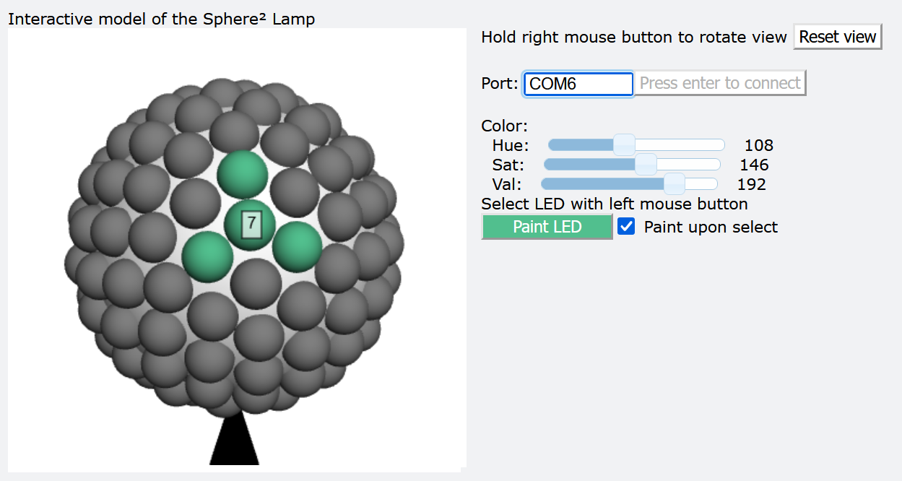

# Sphere² Lamp - Python Controller

The Sphere² Lamp can be controlled from a computer connected to the Arduino Nano via USB serial COM Port.

## Python class

The file [`sphere2lamp.py`](sphere2lamp.py) provides constants and a simple class to control the lamp. 
It requires Python 3 with [pyserial](https://pypi.org/project/pyserial), which can be installed via `pip install pyserial`. 
A usage example can be found at the bottom of the file.

## Interactive 3D control GUI

The file [`interactive3Dcontroller.py`](interactive3Dcontroller.py) provides an interactive 3D model to control the LEDs.
It requires Python 3 with [pyserial](https://pypi.org/project/pyserial), [numpy](https://pypi.org/project/numpy) and [vpython](https://pypi.org/project/vpython), all of which can be installed via `pip install pyserial numpy vpython`.
Executing the file with python will open the HUI in your browser.

