# Sphere² Lamp – Instructions

The geometry of the the Sphere² Lamp is based on a [Goldberg-Polyeder](http://www.3doro.de/kupp_5-6.htm) with 122 faces, specifically the Class II (2,2) polyhedra.

The ratio between the diameter of the sphere and the balls placed on its surface is 25:4.
This allows to use standard 40 mm table tennis balls cut into half and placed on the surface of a 25 cm diameter styrofoam sphere.

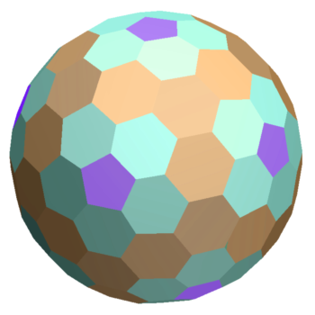
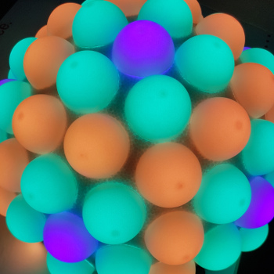

## Requirements

### Materials
- Hollow styrofoam ball, 25 cm in diameter, consisting of two separable halfs
- 61 table tennis ball, 40 mm in diameter, plain white
- 122 adressable RGB LEDs, from a WS2812B Strip
- Microcontroller, e.g. Arduino Nano or Nano BLE
- Power supply, 5V, ~15W, with connector
- Wire

### Tools
- Soldering equipment
- Glue suited for styrofoam (solvent free)
- Compass for drawing circles
- Box cutter, scalpel, fretsaw or similar 
- Pen & paper

## Construction

### Spherical geometry

The image below shows the spherical grid use to mark the positions of the LEDs (white dots) on the sphere.
The black triangle with side length _a_ is repeated 5 times each on the norhern and southern hemisphere, and 10 times around the equator with alternating orientation.
Its height is _b_ and the radius of its inner circle is _h_.
The length of the segments can be calculated using the [half side formula](https://en.wikipedia.org/wiki/Half-side_formula),
which yields for a sphere of radius _R = 12.5_ cm:  
_a = 1.107 R = 13.84_ cm  
_b = 1.017 R = 12.72_ cm  
_h = 0.365 R =  4.56_ cm   

The LEDs are places on the vertices and the center of the "b-h"-segment as shown in the image.
The distances between two LEDs is either of
_(b-h)/2 = 4.08_ cm, _e = 4.28_ cm or _h = 4.56_ cm (where _e_ can be calculated using the [spherical law of cosines](https://en.wikipedia.org/wiki/Spherical_law_of_cosines)).
Therefore balls of 4 cm diameter are choosen to cover each LED.

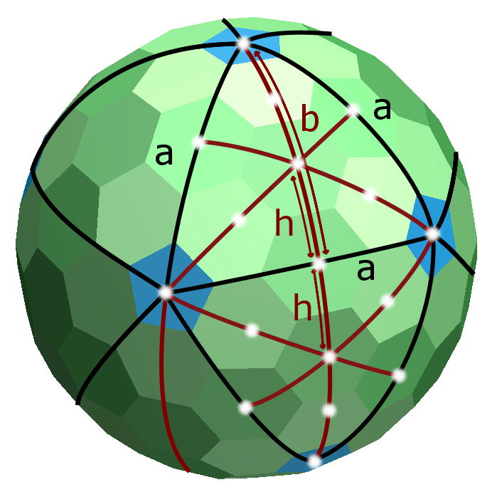

#### Position marks

To mark the positions of the LEDs on the sphere, it is useful to prepare two marking aids.
On a small strip of paper (or two), mark the distances calculated above:  

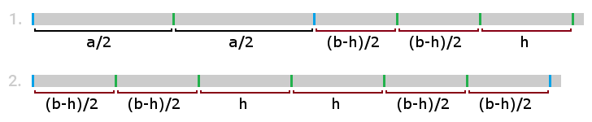

For either half of the styrofoam ball, identify the north (or south) pole and mark it.
Divide the equator (the edge of the half styrofoam ball) in 5 equal segments of _2πR/5 = 15.71_ cm arc length each.
Using the first marking aid, mark the distances _a/2_, _a_ and _a+(b-h)/2_ from the pole towards the equator for each of the 5 directions.
It might be helpful to use a different color for the marks at distance _a_ (the blue ones in the images above).
Next, mark the centers between these (blue) marks at _a/2_.

Now that all positions on the black grid lines shown above are marked, proceed with the second marking aid.
By placing its ends on two of the blue marks, the remaining LED positions on the red lines can be found.
To identify the positions near the equator, put the two half spheres together.
Ten LEDs positions will end up exactly on the equator, it is best to mark five of them on either half of the styrofoam ball.

Using a compass with two peaks set 2 cm appart, carve a circle around each marking.
This will help positioning and gluing the balls later.

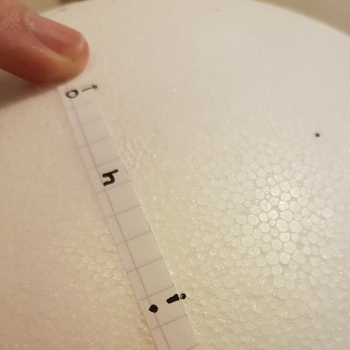
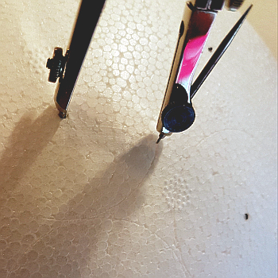

#### Numbering

Number the LED positions as shown below, corresponding to the indices used in the code.
This is important to connect the LEDs in the correct order.

An interactive 3D model that helps with the assignment is provided in the Jupyter Notebook [spherical_geometry.ipynb](spherical_geometry.ipynb) or alternatively [online](https://www.glowscript.org/#/user/eltos/folder/MyPrograms/program/Sphere2-lamp).

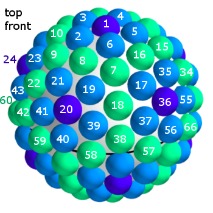
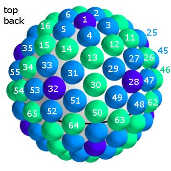  
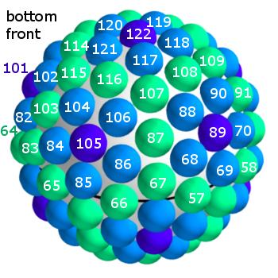
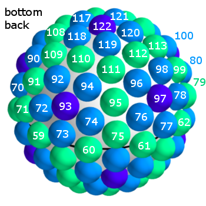

### LEDs

#### Attaching the LEDs

Glue the LEDs on the marked positions.
For the LEDs on the equator, stick 5 to the northern half of the styrofoam ball (numbers 57 to 61) and the other 5 to the southern half (numbers 62 to 66).
You might want to position the pole LEDs (number 1 and/or 122) slightly off center or omit them in favour of a mounting for the lamp.

#### Connecting the data and power wires

Connect the LEDs from number 1 to 61 and 62 to 122 using your soldering equipment.
Stitch the wire through the styrofoam such that the cables won't be visible in the gaps between the table tennis balls later on.
Route the power wires from inside the hollow styrofoam ball stitching them through the sphere.
The connection to the power supply should be close to the center of the supply chain.
Use the connector that came with the LED strip to create a detachable connection (data + power) between LED 61 and 62 inside the sphere, allowing you to take the half spheres easily appart.
Connect the data input of LED 1 with the Arduino Nano (pin D6) and the power to the Vin and GND pins.

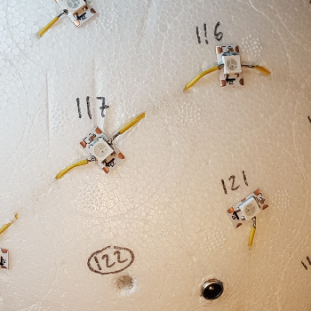
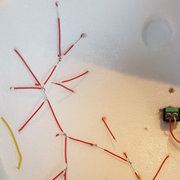

#### Testing

At this point, it is a good idea to test the setup.
This includes checking the connections with a multimeter and then powering up the circuit and confirming the functionality of each LED and their correct order (or adjusting the order in the code).
Check the heat generation and power consumption by running all LEDs on maximum brightness and white color for half an hour or so.
You can use the functions `anim_count();` and `fill_solid(leds, NUM_LEDS, CRGB::White);` from the provided code for testing purposes.

### Balls

#### Cutting

The table tennis balls need to be cut (or sawn) in half.
Typically these balls have a seam from their fabrication which becomes clearly visible when shining light through them.
When cutting the balls, make sure to cut close to this seam, so that it is not visible when the balls are illuminated by the LEDs.

To help cutting the balls in half, a marking aid can be build by rolling a paper strip of 6 cm width around one of the balls.
Every other ball inserted into the resulting tube on top of the reference ball can easily be marked at its middle.

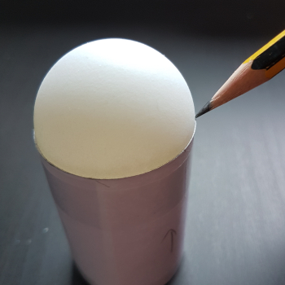
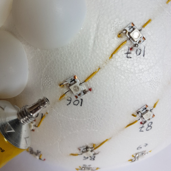

#### Gluing

Glue the halfened table tennis balls to the styrofoam ball using a suitable, solvent free glue (otherwise the solvent will dissolve the styrofoam!).

### Result

Here is an image of how the resulting Sphere² Lamp looks like.

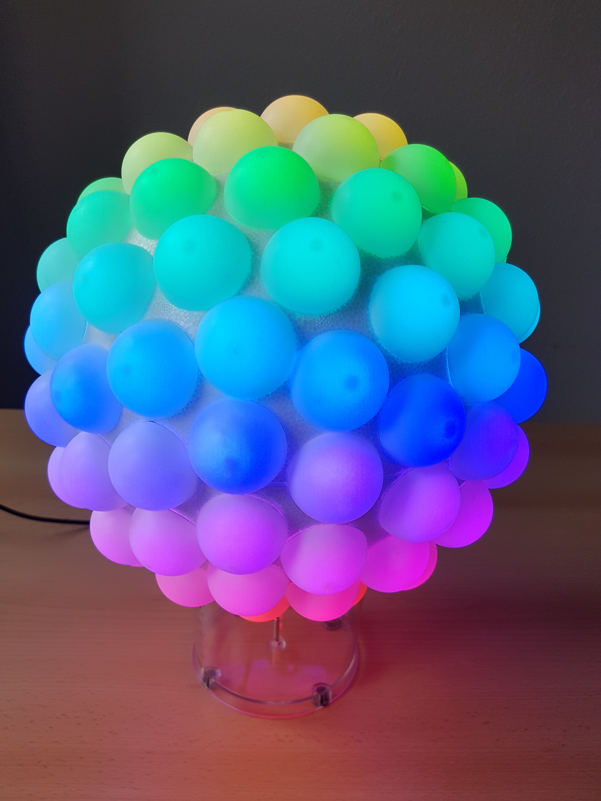
